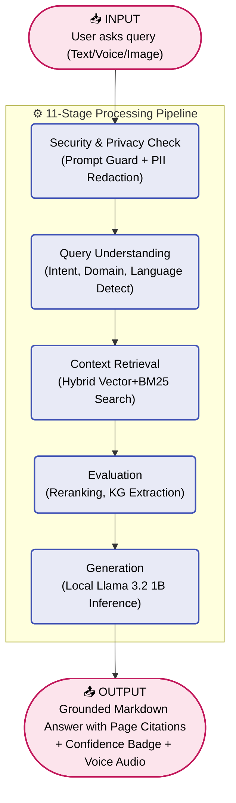
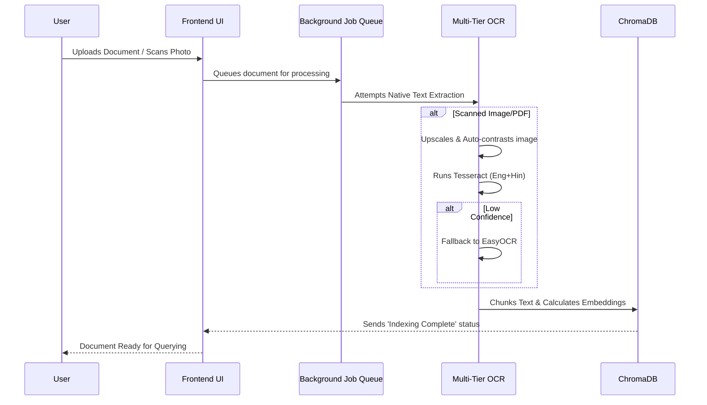

# 📊 Saarthi AI Diagrams for Presentation

Here are the visual diagrams you can use for your presentation. You can take a screenshot of these rendered diagrams and paste them directly into your PDF, or copy the mermaid code if you are using a markdown-to-pdf tool.

## 1. System Architecture (For Page 6)

```mermaid
flowchart LR
    %% Colors and Styles
    classDef input fill:#e1f5fe,stroke:#0288d1,stroke-width:2px,color:#000
    classDef ui fill:#f3e5f5,stroke:#7b1fa2,stroke-width:2px,color:#000
    classDef slm fill:#e8f5e9,stroke:#388e3c,stroke-width:2px,color:#000
    classDef data fill:#fff3e0,stroke:#f57c00,stroke-width:2px,color:#000
    classDef deploy fill:#ffebee,stroke:#d32f2f,stroke-width:2px,color:#000
    classDef output fill:#e0f7fa,stroke:#0097a7,stroke-width:2px,color:#000

    %% User Input
    subgraph Input ["User Input"]
        A1("Text Chat")
        A2("Hindi/Eng Voice")
        A3("Camera / Upload")
    end
    Input:::input

    %% App UI
    B("App / UI\n(React + Vite, SSE Stream)"):::ui

    %% Agent Logic
    subgraph AgentLogic ["SLM / Agent Logic (11-Stage RAG)"]
        direction TB
        C1("1. Prompt Guard & PII Redaction")
        C2("2. Intent & Query Rewrite")
        C3("3. Hybrid Retrieval")
        C4("4. Reranking & Context Compress")
        C5("5. Adaptive Prompt Build")
    end
    AgentLogic:::slm

    %% Tools / DB
    subgraph Database ["Tools / RAG / Database"]
        D1[("ChromaDB Vector Store")]
        D2[("BM25 Index")]
        D3[("Knowledge Graph")]
        D4("OCR & Whisper STT")
    end
    Database:::data

    %% Deployment
    E{"Jetson Deployment\n(Orin Nano, Ollama Llama 3.2 1B)"}:::deploy

    %% Output
    F("Output\n(Cited Response, Confidence Badge, Audio)"):::output

    %% Flow
    Input --> B
    B --> AgentLogic
    AgentLogic <--> Database
    AgentLogic --> E
    E --> F
```

---

## 2. Input → Processing → Output Workflow (For Page 5)

---

## 3. Upload & OCR Processing Workflow

